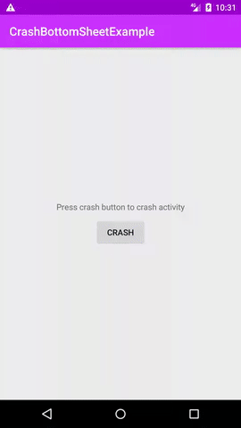
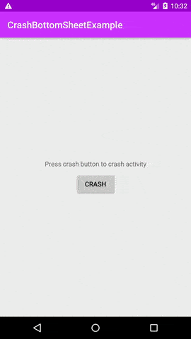

# CrashBottomSheet Library for Android

This library allows android applications to launch a nice beautiful BottomSheetDialog when app crashes instead of displaying a rude, disgusting and universally hated "Unfortunately, X App has stopped!" dialog.

## Before (ugly crash dialog)



## After (beautiful CrashBottomSheet)



## Minimum SDK Requirement

* Minimum SDK >= 19

## Gradle Setup

```gradle
repositories {
    maven { url 'https://jitpack.io' }
}

dependencies {
    implementation 'com.github.dkchalotra:crashbottomsheet:v1.0.0'
}
```

## Maven Setup

```xml
<!-- <repositories> section of pom.xml -->
<repository>
    <id>jitpack.io</id>
   <url>https://jitpack.io</url>
</repository>

<!-- <dependencies> section of pom.xml -->
<dependency>
    <groupId>com.github.dkchalotra</groupId>
    <artifactId>crashbottomsheet</artifactId>
    <version>v1.0.0</version>
</dependency>
```

## CrashBottomSheet - Usage

* Create a custom Application class

```java
public class MyCustomApplication extends Application{
    ...
}
```

* Call ```CrashBottomSheet.register()``` method in either ```onCreate()``` or in default Constructor.

```java
public class MyCustomApplication extends Application{

    public MyCustomApplication(){
        super();

        // Register here
        CrashBottomSheet.register(this);
    }

    ...

    @Override
    public void onCreate(){
        super.onCreate();

        // Or Register here
        CrashBottomSheet.register(this);
    }
}
```

* That's all folks! Enjoy :wink:

## CrashBottomSheet - Strings and Drawable

Do not forget to override the following strings in your application's strings.xml to customize
CrashBottomSheet

```xml
<!--Top title of BottomSheet which defaults to app name-->
<string name="cbs_title">@string/app_name</string>
<!--Bottom description of BottomSheet-->
<string name="cbs_description">Test App has crashed!\nPlease take a moment to report crash and help developers to improve this app.</string>
<!--Label for the Positive Button-->
<string name="cbs_btn_positive">Report</string>
<!--Label for the Negative Button-->
<string name="cbs_btn_negative">Cancel</string>
<!--Content description string for BottomSheet drawable image-->
<string name="cbs_drawable_description">Sad Panda</string>
<!--Developer Email to set in email app. DO NOT FORGET TO SET IT IF YOU USE DEFAULT EMAIL REPORT ACTION-->
<string name="cbs_report_email_to">developer@mailaccount.com</string>
<!--Subject for the email report-->
<string name="cbs_report_email_subject">Crash Report</string>
<!--Toast message string if no email app is installed on device-->
<string name="cbs_toast_no_email_app">No email app found on device.</string>
```

To set a custom drawable image on CrashBottomSheet, you just need to add a new drawable with name `cbs_drawable` in drawable directory of your application.

## CrashBottomSheet - Custom Crash Report Action

Instead of using default email report action, you can write and invoke your own action for crash report when user presses the report button in CrashBottomSheet.

To create custom crash report action you need to register CrashBottomSheet with method `CrashBottomSheet.register(this, your_action_callback)`.

Example -

```java
class MyCustomApplication extends Application {

    public MyCustomApplication(){
        super();

        // Register here or in onCreate()
        CrashBottomSheet.register(this, new CrashBottomSheet.onCrashReport(){
            @Override
            public void handleCrashReport(String stackTrace, DeviceInfo deviceInfo){
                // Write your custom action here to handle crash report.
                // e.g. send report to your server or log it in the file or whatever.

                // You can also use default email action here
                // But don't forget to override `cbs_report_email_to` string in app's strings.xml
                CrashBottomSheet.sendCrashEmail(
                    MyCustomApplication.this,
                    stackTrace,
                    deviceInfo);
            }
        });
    }

}
```

## CrashBottomSheet - CrashLoop

App may enter a never ending crash loop if any exception occurs in Application class code after registering CrashBottomSheet.

To prevent App from CrashLoop CrashBottomSheet handles only those crashes which occurs after a certain time period since last crash i.e. If app is crashing frequently within a small time gap then it is possible that
CrashLoop has been triggered and app is crashing continously.

By default CrashBottomSheet uses crash time gap of 3 secs but you can specify your own crash time gap by using method `CrashBottomSheet.setMinCrashIntervalMs(long ms)` after you call `CrashBottomSheet.register()` method.

**CrashBottomSheet does not allow to set crash time gap value of less than 3 secs. In most of the cases default crash time gap will take care of everything.**

## Support :heart:

If you like this library then please join the stargazers :star: list from this link [CrashBottomSheet Stargazers](https://github.com/dkchalotra/crashbottomsheet/stargazers).

## License :scroll:

Copyright 2020 Dheeraj Kumar

Licensed under the Apache License, Version 2.0 (the "License");
you may not use this file except in compliance with the License.
You may obtain a copy of the License at

http://www.apache.org/licenses/LICENSE-2.0

Unless required by applicable law or agreed to in writing, software
distributed under the License is distributed on an "AS IS" BASIS,
WITHOUT WARRANTIES OR CONDITIONS OF ANY KIND, either express or implied.
See the License for the specific language governing permissions and
limitations under the License.

## Contributions :handshake:

You contribution will be welcomed to make this library better

## Acknowledgement :thumsup:

Sad Panda image used in library is taken from this link [Sad Panda Vector](https://publicdomainvectors.org/en/free-clipart/Sad-panda-drawing/80468.html).

It is available under [Public Domain v1.0](https://creativecommons.org/publicdomain/zero/1.0/) License so there is no need to worry.
